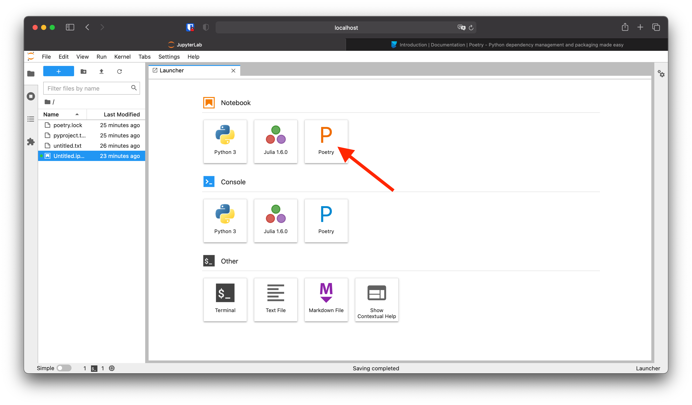

# Poetry Kernel

Use per-directory Poetry environments to run Jupyter kernels. No need to install
a Jupyter kernel per Python virtual environment!

The idea behind this project is to allow you to capture the exact state of your
environment. This means you can email your work to your peers, and they'll have
_exactly_ the same set of packages that you do! Reproducibility!

## Why not virtual environments (venvs)?

Virtual environments were (and are) an important advancement to Python's package
management story, but they have a few shortcomings:

- They are not great for reproducibility. Usually, you'll create a new virtual
  environment using a `requirements.txt` which includes all the direct
  dependencies (numpy, pandas, etc.), but not transient dependencies (pandas
  depends on pytz for timezone support, for example). And usually, even the
  direct dependencies are specified only as minimum (or semver) ranges (e.g.,
  `numpy>=1.21`) which can make it hard or impossible to accurately recreate the
  `venv` later.
- With Jupyter, they usually require that the kernels be installed globally.
  This means you'll need need to have a separate kernelspec for every venv you
  want to use with Jupyter.

Poetry uses venvs transparently under the hood by constructing them from the
`pyproject.toml` and `poetry.lock` files. The `poetry.lock` file records the
exact state of dependencies (and transient dependencies) and can be used to more
accurately reproduce the environment.

Additionally, Poetry Kernel means you only have to install one kernelspec. It
then uses the `pyproject.toml` file from the directory of the notebook (or any
parent directory) to choose which environment to run the notebook in.

## Shameless plug

The reason we created this package was to make sure that the code environments
created for running student code on Pathbird exactly match your development
environment. Interested in developing interactive, engaging, inquiry-based
lessons for your students?
[Check out Pathbird for more information!](https://pathbird.com/)

# Usage

1. [Install Poetry](https://python-poetry.org/docs/#installation) if not yet
   installed.
1. Install this package:
   ```sh
   # NOTE: Do **NOT** install this package in your Poetry project, it should be
   # installed at the system or user level.
   pip3 install --user poetry-kernel
   ```
1. Initialize a Poetry project (only required if you do not have an existing
   Poetry project ready to use):
   ```sh
   poetry init -n
   ```
1. **IMPORTANT:** Add `ipykernel` to your project's dependencies:
   ```sh
   # In the directory of your Poetry project
   poetry add ipykernel
   ```
1. Start a "Poetry" Jupyter kernel and see it in action!
   

# Troubleshooting

## Kernel isn't starting ("No Kernel" message)

**Pro-tip:** Check the output of the terminal window where you launched Jupyter.
It will usually explain why the kernel is failing to start.

1. Make sure that you are launching a notebook in a directory/folder that
   contains a Poetry project (`pyproject.toml` and `poetry.lock` files). You can
   turn a directory into a Poetry project by running:

```sh
poetry init -n
```

2. Make sure that you've installed `ipykernel` into your project:

```sh
poetry add ipykernel
```

3. Make sure the Poetry project is installed! This is especially important for
   projects that you have downloaded from others (**warning:** installing a
   Poetry project could run arbitrary code on your computer, make sure you trust
   your download first!):

   ```sh
   poetry install
   ```

4. Still can't figure it out? Open an issue!

## A package I added won't import properly

If you added the package **after** starting the kernel, you might need to
restart the kernel for it to see the new package.

# FAQ

[See FAQ.md.](FAQ.md)
